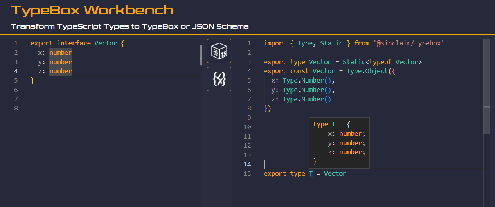

<div align='center'>

<h1>TypeBox Workbench</h1>

<p>Transform TypeScript Types to TypeBox or JSON Schema</p>
	


<br />
<br />

</div>

## Overview

TypeBox Workbench is a web based compiler tool that will transform TypeScript type definitions into TypeBox types or JSON Schema schematics. This tool is written to assert TypeBox alignment with TypeScript as well as to help prototype future enhancements to TypeBox library. TypeBox Workbench is also written to be a general purpose tool to rapidly convert existing TypeScript definitions into TypeBox types.

[TypeBox WorkBench Link](here)

License MIT

## Running Locally

Use the following to run this project locally.

```bash
$ git clone git@github.com:sinclairzx81/typebox-workbench.git
$ cd typebox-workbench
$ npm install
$ npm start
```